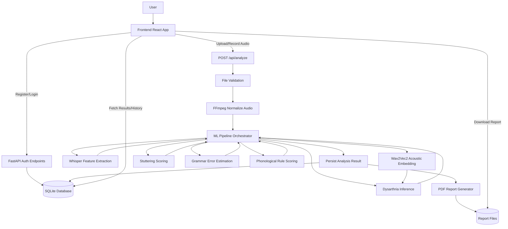
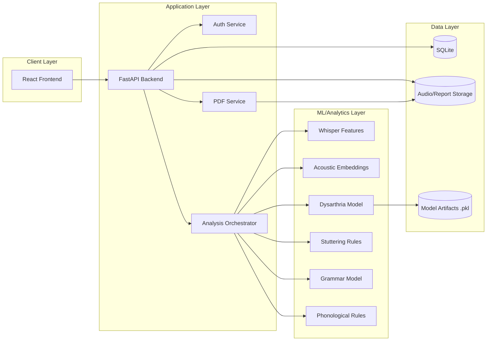

<!-- File Logic Summary: Project-level documentation describing architecture, algorithms, and operational behavior. -->

# SpeechWell Technical Documentation

## 1. Executive Summary
SpeechWell is an end-to-end speech analysis platform that accepts uploaded or live-recorded audio, runs a multi-stage analysis pipeline, stores results, and generates downloadable clinical-style PDF reports.

The system combines:
- Deep-learning feature extraction (Whisper, Wav2Vec2)
- A trained dysarthria classifier (logistic regression over engineered + acoustic features)
- Rule-based estimators (stuttering and phonological indicators)
- Grammar correction and grammar-error probability estimation
- Full-stack integration (React frontend + FastAPI backend + SQLite persistence)

This document is written for technical evaluation and viva/invigilator review.

## 2. Objectives and Scope
Primary objective:
- Provide structured, explainable, and repeatable speech-quality indicators from a single audio sample.

Current output dimensions:
- Dysarthria probability + label
- Stuttering probability + event breakdown
- Grammar error probability + corrected transcript
- Phonological error probability + affected words
- Timing/fluency metrics (speaking rate, pauses, duration)
- Consolidated downloadable PDF report

Non-goals:
- This system is not a medical diagnostic device.
- Scores are decision-support indicators, not clinical diagnosis.

## 3. System Architecture

### 3.1 High-level components
- Frontend (`speechwell-frontend/`): user interaction, upload/recording, result visualization.
- Backend API (`backend/app/main.py`): authentication, orchestration, persistence, report delivery.
- ML pipeline (`ml/services/` + `ml/feature_extraction/` + `backend/app/services/`): feature extraction and scoring.
- Data layer (`backend/app/database/` + SQLite): durable storage for users, analyses, metadata.
- Artifact storage (`storage/`): uploaded audio, normalized audio, generated reports.

### 3.2 Runtime request flow (single analysis)
1. Frontend sends `POST /api/analyze` with audio file + optional bearer token.
2. Backend validates MIME/extension and stores original file in `storage/uploaded_audio/`.
3. Backend inserts analysis row with `status="processing"`.
4. Backend normalizes audio via FFmpeg to mono 16k WAV in `storage/processed_audio/`.
5. Backend executes `run_full_analysis(...)`.
6. Backend writes scores, transcript fields, timing metrics, and status into DB.
7. Backend generates report in `storage/reports/` and stores report path.
8. Frontend fetches detailed result (`GET /api/analyze/{audio_id}`) and renders cards/charts/transcripts.

### 3.3 Authentication wiring
- Registration/login endpoints return JWT bearer token.
- Frontend stores token in `localStorage` and sends it in `Authorization: Bearer ...`.
- Backend decodes token to resolve current user and scope history/report access.

## 4. End-to-End ML/Analysis Pipeline

Main orchestrator:
- `ml/services/speech_analysis_service.py` -> `run_full_analysis(audio_path)`

Pipeline stages:
1. Whisper feature extraction
2. Grammar analysis
3. Acoustic embedding extraction
4. Dysarthria inference
5. Stuttering scoring
6. Phonological scoring
7. Structured result assembly

Fault tolerance policy:
- Each stage is wrapped with fallback behavior.
- If a stage fails, the pipeline returns safe defaults (mostly zeros) instead of aborting the whole request.
- This keeps UX resilient while preserving failure visibility (`status` and `error_message` in DB when fatal).

## 5. Detailed Algorithm Specifications

## 5.1 Audio normalization
File: `backend/app/main.py` (`normalize_audio`)

Command behavior:
- `ffmpeg -i input -ac 1 -ar 16000 output.wav`

Why:
- Forces consistent channel count and sample rate for downstream models.
- Reduces model variance caused by mixed input formats.

## 5.2 Whisper transcript + timing features
File: `ml/feature_extraction/extract_whisper.py`

Model:
- OpenAI Whisper `base`.

Extracted objects:
- Transcript text
- Segment list (`start`, `end`, `text`)
- Aggregated fluency metrics

Definitions:
- `total_words = len(transcript.split())`
- For each segment `i`: `dur_i = end_i - start_i`
- `total_duration_sec = sum(dur_i)`
- Inter-segment pause: `pause_i = start_i - end_{i-1}` if positive
- `average_pause_sec = mean(pause_i)` (0 if none)
- `max_pause_sec = max(pause_i)` (0 if none)
- `speaking_rate_wps = total_words / total_duration_sec` (0 if duration == 0)

Output contract:
- `transcript`, `total_words`, `speaking_rate_wps`, `average_pause_sec`, `max_pause_sec`, `total_duration_sec`, `segments`

## 5.3 Acoustic embedding extraction
File: `ml/feature_extraction/extract_acoustic.py`

Model:
- `facebook/wav2vec2-base` (local/offline load).

Processing steps:
1. Read waveform via `soundfile`.
2. Convert multi-channel audio to mono by averaging channels.
3. Resample to 16kHz if needed.
4. Tokenize waveform with `Wav2Vec2Processor`.
5. Run `Wav2Vec2Model` inference.
6. Mean-pool last hidden state across time.

Output:
- Fixed-size 768-dimensional embedding vector.

Fallback:
- Returns zero vector `[0.0] * 768` if model unavailable.

## 5.4 Dysarthria model inference
File: `backend/app/services/dysarthria_inference_service.py`

Artifacts:
- `ml/models/dysarthria_scaler_v1.pkl`
- `ml/models/dysarthria_pca_v1.pkl`
- `ml/models/dysarthria_model_v1.pkl`

Input feature set:
- Fluency vector (3 dims):
  - `speaking_rate_wps`
  - `average_pause_sec`
  - `max_pause_sec`
- Acoustic vector (768 dims)

Algorithm:
1. Scale acoustic vector using persisted `StandardScaler`.
2. Apply persisted PCA transform.
3. Concatenate fluency + PCA acoustic features.
4. Predict positive class probability using logistic regression:
   - `p_dys = model.predict_proba(X)[0][1]`
5. Decision rule:
   - `label = "dysarthria" if p_dys >= 0.5 else "healthy"`

Returned fields:
- `probability = round(p_dys, 3)`
- `label`

## 5.5 Stuttering probability algorithm
File: `backend/app/services/stuttering_service.py`

Inputs:
- Whisper transcript and segments.

Subscores:
1. Repetition count
- Consecutive repeated tokens in transcript:
- `repetitions = sum(1 for i in [1..n-1] if words[i] == words[i-1])`

2. Prolongation count
- Regex pattern `(.)\1{3,}` counts character runs length >= 4.

3. Block count
- Segment gaps interpreted as blocks when `start_i - end_{i-1} >= 1.0 sec`.

Composite score:
- `raw = 0.4*repetitions + 0.4*prolongations + 0.2*blocks`
- `stuttering_probability = min(raw / 5, 1.0)`
- Returned rounded to 3 decimals.

## 5.6 Grammar correction and grammar-error probability
File: `backend/app/services/grammar_service.py`

Model:
- `prithivida/grammar_error_correcter_v1` (text2text seq2seq, local/offline).

Process:
1. Generate corrected text from transcript.
2. Estimate difference by token-count shift:
   - `diff = abs(len(original_words) - len(corrected_words))`
3. Floor estimate to 5% of original length:
   - `error_estimate = max(diff, int(0.05 * len(original_words)))`
4. Normalize:
   - `grammar_error_probability = min(error_estimate / max(len(original_words),1), 1.0)`

Returned:
- `grammar_error_probability` (rounded)
- `error_count_estimate`
- `corrected_text`

Important semantic note:
- DB field name is `grammar_score`, but stored value currently represents **error probability**.
- Higher value indicates more detected issues (not better language quality).

## 5.7 Phonological error probability
File: `backend/app/services/phonological_service.py`

Rule set:
- `R -> W`, `K -> T`, `G -> D`, `S -> TH`, `TH -> F/D`, `L -> W`

Process:
1. Convert transcript into words.
2. Query expected phonemes per word using CMU dictionary (`pronouncing`).
3. For each rule, detect phoneme/substitution co-occurrence pattern.
4. Increment `error_count` and collect affected words.

Probability:
- `phonological_error_probability = min(error_count / max(word_count,1), 1.0)`

## 5.8 PDF severity mapping
File: `backend/app/services/pdf_report_service.py`

Severity thresholds used for bars:
- `< 0.30` -> LOW
- `0.30 to < 0.60` -> MODERATE
- `>= 0.60` -> HIGH

Applied to dysarthria, stuttering, and grammar blocks in report layout.

## 6. Frontend Interpretation Logic

## 6.1 Dashboard risk bins
File: `speechwell-frontend/src/pages/Dashboard.tsx`

Dysarthria and stuttering risk mapping:
- High: `>= 0.40`
- Moderate: `>= 0.25 and < 0.40`
- Low: `< 0.25`

Grammar badge mapping in UI:
- Good: `>= 0.80`
- Moderate: `>= 0.60`
- Low: `< 0.60`

## 6.2 History filter bins
File: `speechwell-frontend/src/pages/History.tsx`

Filter basis:
- `max(dysarthria_probability, stuttering_probability)`

Bins:
- High: `>= 0.40`
- Moderate: `>= 0.25 and < 0.40`
- Low: `< 0.25`

## 6.3 Results page overall score
File: `speechwell-frontend/src/pages/Results.tsx`

Current formula:
`overallScore = round(((1 - dysarthria_probability)*0.33 + (1 - stuttering_probability)*0.33 + grammar_score*0.34) * 100)`

Label bands:
- `>= 80` Excellent
- `>= 60` Good
- `>= 40` Fair
- `< 40` Needs Improvement

Note:
- Because `grammar_score` currently stores grammar-error probability, this term is directionally inconsistent with the two inverted risk terms.

## 7. Model Training and Artifact Generation

## 7.1 Dataset indexing
File: `ml/training/build_torgo_dataset.py`

- Scans TORGO directory by healthy/dysarthria class folders.
- Writes indexed metadata CSV: `ml/training/torgo_index.csv`.

## 7.2 Feature extraction for training
File: `ml/feature_extraction/extract_torgo_features.py`

For each indexed audio:
1. Run whisper feature extraction.
2. Run acoustic embedding extraction.
3. Store features + labels in `ml/training/torgo_features_full.pkl`.

## 7.3 Baseline model training
File: `ml/training/train_dysarthria_model.py`

- Uses only 3 fluency features.
- Trains logistic regression baseline.
- Outputs evaluation report and confusion matrix.

## 7.4 Full model training
File: `ml/training/train_dysarthria_full.py`

Pipeline:
1. Load full extracted features.
2. Scale acoustic embeddings.
3. PCA dimensionality reduction.
4. Concatenate fluency + PCA features.
5. Train class-balanced logistic regression.
6. Evaluate (classification report, confusion matrix).
7. Persist model artifacts (`model`, `pca`, `scaler`) to `ml/models/`.

## 8. Backend API Contract

## 8.1 Endpoints
- `POST /api/auth/register`
- `POST /api/auth/login`
- `POST /api/analyze`
- `GET /api/analyze/{audio_id}`
- `GET /api/analyses`
- `GET /api/reports/{audio_id}`
- `GET /api/health`

## 8.2 Core analysis response fields
- Identity: `id`, `audio_id`, `filename`, `created_at`, `status`
- Dysarthria: `dysarthria_probability`, `dysarthria_label`
- Stuttering: `stuttering_probability`, `stuttering_repetitions`, `stuttering_prolongations`, `stuttering_blocks`
- Grammar: `grammar_score`, `grammar_error_count`, `corrected_text`
- Phonology: `phonological_score`, `phonological_error_count`
- Fluency metrics: `speaking_rate_wps`, `average_pause_sec`, `max_pause_sec`, `total_duration_sec`
- Text/report artifacts: `transcript`, `pdf_path`

## 9. Database Design
File: `backend/app/database/models.py`

Tables:
- `users`
  - credential identity and profile fields
- `analyses`
  - one row per analyzed audio with all outputs and artifact paths

Lifecycle states:
- `processing` -> created before ML pipeline
- `completed` -> scores + report persisted
- `failed` -> fatal exception captured in `error_message`

## 10. Security and Access Control
- Passwords hashed (PBKDF2 path; bcrypt compatibility path).
- JWT bearer tokens used for authenticated API access.
- Ownership checks enforced on result/report retrieval when user context exists.
- CORS enabled for local frontend origins (plus wildcard in current dev config).

## 11. Reliability and Failure Handling
- Stage-level fallbacks in ML pipeline prevent total failure on partial model outages.
- Backend records fatal processing errors into analysis row for observability.
- Health endpoint (`/api/health`) provides basic service liveness check.

## 12. Main code logic inventory (concise)

### Frontend runtime
- `speechwell-frontend/src/App.tsx`: route registry and page composition.
- `speechwell-frontend/src/api/api.ts`: network API abstraction.
- `speechwell-frontend/src/pages/Upload.tsx`: upload + recording + submit flow.
- `speechwell-frontend/src/pages/Results.tsx`: detailed result visualization.
- `speechwell-frontend/src/pages/Dashboard.tsx`: aggregated progress and risk summaries.
- `speechwell-frontend/src/pages/History.tsx`: filterable history browsing.
- `speechwell-frontend/src/pages/Reports.tsx`: downloadable reports list.

### Backend runtime
- `backend/app/main.py`: endpoint orchestration and persistence.
- `backend/app/database/db.py`: DB engine/session setup.
- `backend/app/database/models.py`: schema definition.
- `backend/app/schemas.py`: request/response contracts.
- `backend/app/services/auth_service.py`: auth/token logic.
- `backend/app/services/pdf_report_service.py`: report generation.

### ML runtime
- `ml/services/speech_analysis_service.py`: analysis coordinator.
- `ml/feature_extraction/extract_whisper.py`: transcript + timing features.
- `ml/feature_extraction/extract_acoustic.py`: acoustic embeddings.
- `backend/app/services/dysarthria_inference_service.py`: dysarthria classifier inference.
- `backend/app/services/stuttering_service.py`: stuttering rule-based scorer.
- `backend/app/services/grammar_service.py`: grammar error estimator.
- `backend/app/services/phonological_service.py`: phonological rule scorer.

## 13. Large data/runtime directories
- `ml/datasets/torgo/`: raw corpus files for training.
- `storage/uploaded_audio/`: original uploaded user files.
- `storage/processed_audio/`: normalized WAV files for analysis.
- `storage/reports/`: generated PDF outputs.
- `speechwell.db` / `backend/speechwell.db`: SQLite data stores, depending on startup working directory.

## 14. Limitations and recommended improvements
Current limitations:
- Grammar field naming/semantics mismatch (`grammar_score` stores error probability).
- Mixed methodology (ML + heuristics) can produce non-uniform calibration.
- CORS dev configuration is permissive for production hardening.

Recommended next improvements:
1. Align grammar metric naming and frontend interpretation.
2. Add calibration/threshold validation studies per output dimension.
3. Add integration tests for full upload -> analyze -> report path.
4. Add model/version metadata to analysis rows for traceability.
5. Introduce structured observability (timings, model-stage logs).

## 15. Compliance note
SpeechWell outputs are AI-assisted analytical indicators and should be interpreted as supportive screening information, not standalone medical diagnosis.

## 16. Algorithm Summary (All in One Place)
This section is a quick-reference list of all core algorithms used in SpeechWell.

### 16.1 Audio normalization (preprocessing)
- Location: `backend/app/main.py` (`normalize_audio`)
- Method: FFmpeg resampling and channel normalization
- Operation: convert input to mono (`-ac 1`) and 16kHz (`-ar 16000`)
- Purpose: ensure all downstream models receive consistent audio format.

### 16.2 Transcript and fluency feature extraction
- Location: `ml/feature_extraction/extract_whisper.py`
- Model: Whisper `base`
- Outputs:
  - transcript text
  - segment timestamps
  - `speaking_rate_wps = total_words / total_duration_sec`
  - `average_pause_sec = mean(inter-segment pauses)`
  - `max_pause_sec = max(inter-segment pauses)`
  - total duration
- Purpose: generate linguistic and timing features used by multiple downstream scorers.

### 16.3 Acoustic embedding extraction
- Location: `ml/feature_extraction/extract_acoustic.py`
- Model: `facebook/wav2vec2-base`
- Steps:
  - read waveform
  - mono conversion (if multi-channel)
  - resample to 16kHz
  - run Wav2Vec2
  - mean-pool hidden states
- Output: fixed 768-dimensional embedding vector.

### 16.4 Dysarthria classifier
- Location: `backend/app/services/dysarthria_inference_service.py`
- Artifacts:
  - scaler: `dysarthria_scaler_v1.pkl`
  - PCA: `dysarthria_pca_v1.pkl`
  - model: `dysarthria_model_v1.pkl` (logistic regression)
- Inputs:
  - fluency vector: `[speaking_rate_wps, average_pause_sec, max_pause_sec]`
  - acoustic embedding vector
- Algorithm:
  1. scale embedding
  2. PCA transform
  3. concatenate fluency + PCA features
  4. compute probability with `predict_proba`
- Decision rule:
  - label `dysarthria` if probability `>= 0.5`, else `healthy`.

### 16.5 Stuttering probability scorer
- Location: `backend/app/services/stuttering_service.py`
- Components:
  - repetitions: adjacent identical words
  - prolongations: repeated characters via regex `(.)\\1{3,}`
  - blocks: segment gap `>= 1.0s`
- Composite formula:
  - `raw = 0.4*repetitions + 0.4*prolongations + 0.2*blocks`
  - `stuttering_probability = min(raw / 5, 1.0)`
- Purpose: estimate disfluency severity from transcript + timing cues.

### 16.6 Grammar error probability estimator
- Location: `backend/app/services/grammar_service.py`
- Model: `prithivida/grammar_error_correcter_v1` (seq2seq correction)
- Process:
  1. generate corrected text
  2. compare original vs corrected token counts
  3. estimate error count with floor at 5% of original length
- Formula:
  - `diff = abs(len(original_words) - len(corrected_words))`
  - `error_estimate = max(diff, int(0.05 * len(original_words)))`
  - `grammar_error_probability = min(error_estimate / max(len(original_words), 1), 1.0)`
- Output also includes AI-corrected transcript.

### 16.7 Phonological error probability estimator
- Location: `backend/app/services/phonological_service.py`
- Method: rule-based phoneme substitution checks using CMU pronunciation lookup (`pronouncing`)
- Rule examples:
  - `R->W`, `K->T`, `G->D`, `S->TH`, `TH->F/D`, `L->W`
- Formula:
  - `phonological_error_probability = min(error_count / max(word_count, 1), 1.0)`
- Output includes affected word list.

### 16.8 End-to-end orchestration algorithm
- Location: `ml/services/speech_analysis_service.py`
- Flow:
  1. Whisper features
  2. Grammar analysis
  3. Acoustic embedding
  4. Dysarthria inference
  5. Stuttering scoring
  6. Phonological scoring
  7. return combined structured result
- Design property: stage-level fallback defaults prevent full pipeline collapse if one model fails.

### 16.9 Frontend overall speech health score formula
- Location: `speechwell-frontend/src/pages/Results.tsx`
- Formula:
  - `overallScore = round(((1 - dysarthria_probability) * 0.33 + (1 - stuttering_probability) * 0.33 + grammar_score * 0.34) * 100)`
- Purpose: single dashboard-style percentage for user-friendly summary.

### 16.10 PDF severity mapping algorithm
- Location: `backend/app/services/pdf_report_service.py`
- Severity bins for probability metrics:
  - LOW: `< 0.30`
  - MODERATE: `0.30 to < 0.60`
  - HIGH: `>= 0.60`
- Used to render report bars/colors for fast human interpretation.

## 17. Data Flow Diagram (DFD Code)
Use this Mermaid code in Markdown viewers that support Mermaid.

## 18. Block Diagram (Code)

## 19. Viva Script (Short, Ready-to-Speak)

### 19.1 Project opening (30-45 sec)
"SpeechWell is an AI-assisted speech analysis platform. A user uploads or records speech, the backend normalizes audio, then a multi-stage ML pipeline extracts transcript, acoustic and fluency features, and computes dysarthria, stuttering, grammar, and phonological indicators. Results are persisted in SQLite and exported as a downloadable PDF report."

### 19.2 Architecture explanation
"The frontend is React and handles authentication, upload/recording, and result visualization. FastAPI is the orchestration layer with endpoints for auth, analysis, history, and reports. ML components are modular: Whisper for transcript/timing, Wav2Vec2 for embeddings, logistic regression for dysarthria, and rule-based scorers for stuttering and phonology. All outputs are stored in the analyses table."

### 19.3 Algorithm explanation summary
"We use FFmpeg normalization first to control input variability. Whisper gives transcript and segment timing from which we compute speaking rate and pauses. Wav2Vec2 produces a 768-dimensional embedding. Dysarthria probability is predicted from fluency plus PCA-transformed acoustic features using a trained logistic model. Stuttering score is weighted from repetitions, prolongations, and block pauses. Grammar score is based on model-corrected text difference. Phonological score is rule-based over pronunciation lookups."

### 19.4 Why this approach
"We combine learned models and rule-based methods for balance: learned embeddings capture rich acoustic information while rule-based parts improve interpretability. This gives both performance and explainability for academic demonstration."

### 19.5 Validation and reliability line
"The system uses fail-safe defaults in each pipeline stage so partial model failures do not crash user flow. Backend stores processing status and error messages, and frontend exposes errors cleanly."

### 19.6 Limitations line
"This is a support and screening tool, not a medical diagnosis system. Also, grammar field naming currently stores error probability, so interpretation should be calibrated in future work."

### 19.7 Future work line
"Next steps include calibration studies, model/version traceability per analysis row, stronger automated integration tests, and production-grade security and observability."

### 19.8 Likely viva Q&A
Q: Why normalize audio to 16k mono?  
A: To reduce model input variance and ensure consistent feature extraction across devices/files.

Q: Why use both Whisper and Wav2Vec2?  
A: Whisper provides transcript and timing semantics; Wav2Vec2 provides rich acoustic representation for motor-speech classification.

Q: Why logistic regression for dysarthria?  
A: It is stable, interpretable, and works well with engineered + PCA-reduced features for this dataset scale.

Q: Is grammar score truly a quality score?  
A: In current implementation it is grammar-error probability; naming should be aligned in a refinement pass.

Q: How do you handle model failure?  
A: Stage-level try/except fallbacks return safe defaults; fatal issues set analysis status to failed with error message.
